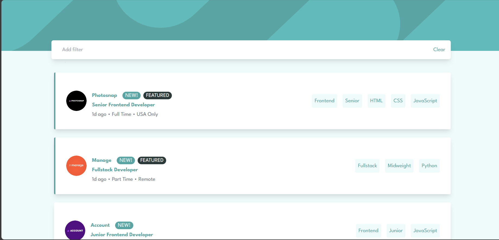

# Frontend Mentor - Job listings with filtering solution

This is a solution to the [Job listings with filtering challenge on Frontend Mentor](https://www.frontendmentor.io/challenges/job-listings-with-filtering-ivstIPCt). Frontend Mentor challenges help you improve your coding skills by building realistic projects. 

## Table of contents

- [Frontend Mentor - Job listings with filtering solution](#frontend-mentor---job-listings-with-filtering-solution)
  - [Table of contents](#table-of-contents)
  - [Overview](#overview)
    - [The challenge](#the-challenge)
    - [Screenshot](#screenshot)
    - [Links](#links)
  - [My process](#my-process)
    - [Built with](#built-with)
    - [What I learned](#what-i-learned)
  - [Technical Skills](#technical-skills)
  - [Soft Skills](#soft-skills)
  - [Author](#author)

## Overview

### The challenge

Users should be able to:

- View the optimal layout for the site depending on their device's screen size
- See hover states for all interactive elements on the page
- Filter job listings based on the categories

### Screenshot

### Links

- Solution URL: 
- Live Site URL: 

## My process

### Built with

- Semantic HTML5 markup
- Flexbox
- Mobile Responsive workflow
- [React](https://reactjs.org/) - JS library
- [Next.js](https://nextjs.org/) - React framework
- [TailwindCss](https://tailwindcss.com/) - For styles
- [Typescript](https://www.typescriptlang.org/) - For adding types

### What I learned

## Technical Skills
1. Responsive Design: Learned how to create a responsive design using Tailwind CSS, effectively employing utility classes to ensure the layout adapts gracefully across a range of device sizes, from mobile to desktop.

2. CSS Styling with Tailwind CSS: Deepened my understanding of Tailwind CSS, learning how to use utility classes to style components, manage spacing, and handle responsive breakpoints.

3. React Component Design: Enhanced my skills in React, learning to create components that are flexible and reusable, and understanding how to manage props to dynamically handle content.

4. Image Handling: Gained insights into the proper handling of images in a React project, learning how to utilize the Image component to manage image properties and ensure optimal loading performance.
I learned more about 

## Soft Skills
1. Problem-Solving: Improved problem-solving abilities by tackling challenges related to CSS styling and layout design, working to find solutions that met the project’s specific needs.

2. Attention to Detail: Cultivated a keen attention to detail, working to ensure that every element of the design met the specified requirements, down to the smallest details of color, spacing, and typography.

3. Adaptability: Learned to adapt to changing requirements, working flexibly to incorporate new elements into the design and adjust styling as needed.

## Author

- Frontend Mentor - [@ogeeDeveloper](https://www.frontendmentor.io/profile/ogeeDeveloper)
- Twitter - [@DeveloperOgee](https://twitter.com/DeveloperOgee)
- LinkenIn - [@omaro-g-508a6b1bb](https://www.linkedin.com/in/omaro-g-508a6b1bb/)
